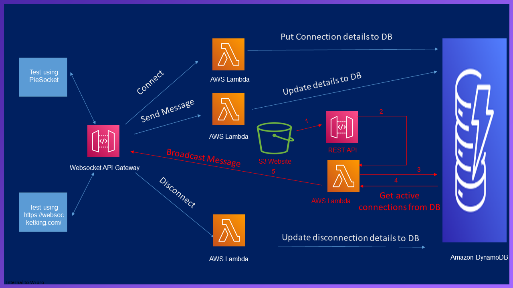

## Architecture
<p align="center">
   
</p>

## Steps to replicate
  
  1. Setup DynamoDB
  
     **1.1** Create Table "UserDetails" with below fields with least provisioned capacity
     
	    **i.** EmailID as String and as a Partition key
		
	    **ii.** FName as String
		
	    **iii.** LName as String
		
	    **iv.** LastestGreetingTime as String
		
		
  2. Create Lambda functions
  
      **2.1** Create Nodejs Lambda "ProcesseDetailsDynamoDB_Node_js" for getting details from DynamoDB and add "AmazonDynamoDBReadOnlyAccess" managed IAM policy 
      
      **2.2** Create Python Lambda "SetDetailsDynamoDB" for writing details to DynamoDB and add "AmazonDynamoDBFullAccess" managed IAM policy

  3. Create API gateway
  
       **3.1** Create public API and create a GET method with below details.
       
		**i.** Under "Method Request" add "URL Query String Parameters" and add EmailID as required parameter
		
		**ii.** Under "Method Request" add "Request Validator" to be "Validate body, query string parameters, and headers"
		
		**iii.** Under "Integration Request" redirect requests to "ProcesseDetailsDynamoDB_Node_js" lambda which was created		
		
       **3.2** Create a POST method with below details.
       
		**i.** Under "Integration Request" redirect requests to "SetDetailsDynamoDB" lambda which was created
		
       **3.3** Enable CORS 
       
       **3.4** Deploy API under the Deployment stage as "dev"
		
  4. Setup S3 public bucket

       **4.1** Create a public bucket with below bucket policy
	 ```bash
		{
	    "Version": "2012-10-17",
	    "Statement": [
		{
		    "Sid": "PublicRead",
		    "Effect": "Allow",
		    "Principal": "*",
		    "Action": [
			"s3:GetObject",
			"s3:GetObjectVersion"
		    ],
		    "Resource": "arn:aws:s3:::#bucketname#/*"
		}
	    ]
		}
	  ```
	
       **4.2**  Edit "userDetails.html" and modify the below in line 41 to add API gateway connection url   
        ```bash
		fetch("#API_gateway_Connection_URL#/dev", requestOptions)"
		```
	
       **4.3**  Edit "index.html" and modify the below in line 22 to add API gateway connection url  
	   ```bash
		url: '#API_gateway_Connection_URL#/dev',
		```
	
       **4.4**  Upload "jquery-3.1.1.min","knockout-3.4.2","index.html" and "userDetails.html"
   
  5. Access the website

      **5.1**  Use "userDetails.html" to upload user details
      
      **5.2**  Use "index.html" to access user details

## Youtube references

<!-- YOUTUBE:START -->
- [Get User details from DynamoDB](https://www.youtube.com/watch?v=PzNQXYWQQ7c)
- [Upload User details to DynamoDB](https://www.youtube.com/watch?v=n5XFPLo4Bbw&t=2692s)
<!-- YOUTUBE:END -->


<!-- 1. item1
1. item2
    1. subitem1
    2. subitem2 -->

